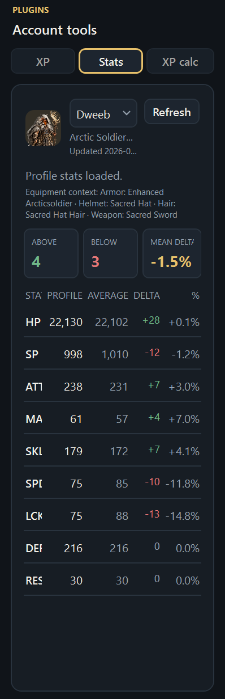
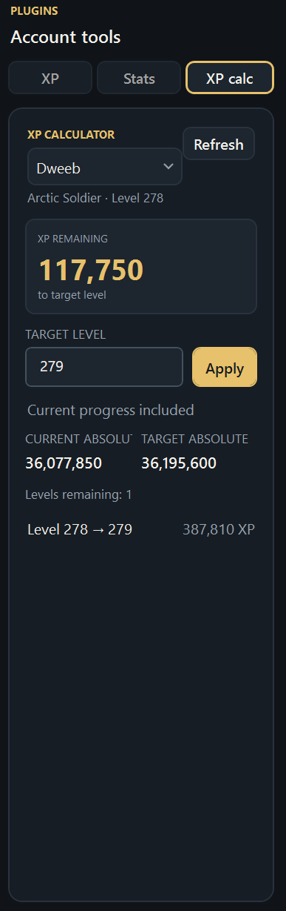
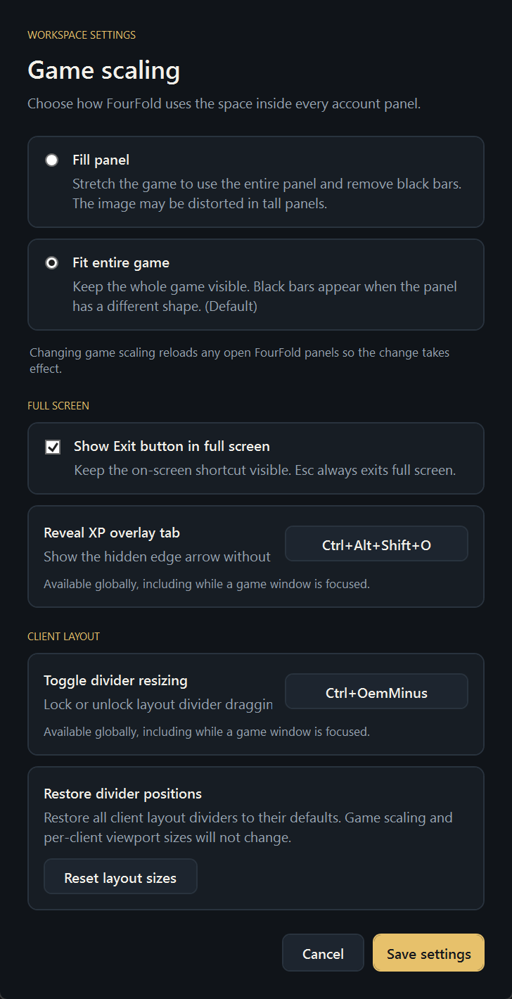

# FourFold Account Manager

A Windows desktop client for managing FourFold accounts, saved logins, multi-client layouts, and profile tools in separate browser sessions.

<details>
<summary><strong>Showcase</strong> — click to view screenshots</summary>

| Class Comparison | XP Calculator |
|---|---|
|  |  |
| **Workspace Settings** |  |
|  |  |

</details>

## Features

- **Account profiles** — Create, edit, favorite, reorder, and remove local profiles. Saved credentials use Windows Credential Manager.
- **Flexible layouts** — Run 1×1, 1×2, 2×1, 2×2, 2×3, or vertical split client layouts together.
- **Plugins** — Use XP Tracker, Class Comparison, and XP Calculator from the right-side Plugins sidebar.
- **Game controls** — Fit or fill each game panel, adjust viewport sizes, use full screen, and configure keyboard shortcuts.
- **Updates** — Stable Windows releases are published through [GitHub Releases](https://github.com/CodySimonds65/FourFoldAccountManager/releases).

## Profile tools

Choose an account directly from the dropdown on the **Stats** or **XP Calculator** tab. The selected profile refreshes automatically.

- **Class Comparison** reads the profile’s active class and compares its displayed HP, SP, ATT, MAG, SKL, SPD, LCK, DEF, and RES values against projected class averages. Equipment is shown for context only.
- **XP Calculator** calculates progress to a target level using `5 × level × (level + 1)` for next-level caps and `(5 / 3) × (level³ - level)` for cumulative XP.
- Usernames in the top-200 ranking resolve to profile IDs automatically. Ambiguous or out-of-ranking users can be linked with a verified profile ID or URL.

## XP Tracker

The tracker polls every minute and shows XP/hour, session XP, active class, XP to next level, and time-to-level estimates. Right-click a row to reset its XP/hour rate or all tracking data. Tracker behavior and overlays remain available inside the Plugins sidebar.

## Requirements

- Windows
- .NET 10 SDK/runtime
- Microsoft Edge WebView2 Runtime

## Run from source

```powershell
dotnet build FourFoldAccountManager.sln -c Release
dotnet run --project src/FourFoldAccountManager.Desktop/FourFoldAccountManager.Desktop.csproj
```

Windows releases include a framework-dependent ZIP, standalone executable, and checksums file. The release workflow currently publishes `win-x64` assets only.

## Shared XP leaderboard pilot

The shared leaderboard is an opt-in feature under development. This repository contains a one-instance Render Free service blueprint and a Neon PostgreSQL setup path. No service URL is bundled with the desktop app. Until deployment is approved, the board displays a configuration status and makes no online leaderboard calls. Local XP tracking continues independently.

### Data and scoring

Enabling **Share linked accounts** sends a random installation ID, the sharing choice, each linked profile's public player ID and public ranking username, and the IDs of opted-in profiles whose game views are open. The desktop sends no saved game credentials, Windows credentials, local account GUIDs, local profile labels, or client-computed XP totals. A linked public profile is a user's enrollment choice; linking does not prove ownership of the game account. The host may process request IP addresses for normal web logs and rate limiting.

The service reads public profiles only when collection has been separately enabled and an active signal is fresh. Desktop heartbeats renew once a minute while opted-in game views are open; active leases expire after three missed renewals (three minutes). One player ID is sampled once per approved interval across all installations. The first sample creates a zero-score baseline; failed, mismatched, and uncertain intervals add no gain. The public API reports only an aggregate count of enrolled profiles without a measured gain until they qualify for a ranked row. Daily periods start at 00:00 UTC, ISO weeks start Monday 00:00 UTC, and months start on the first day at 00:00 UTC. Period ends are exclusive. The API shows current periods only, with no historical archive. The service prunes score events older than 40 days daily while running and also removes installations without a heartbeat for 40 days, including their profile links, even when collection is disabled. It retains the latest public XP snapshot for future baselines; opting out stops new sampling but does not erase gains already recorded in the current period. A deletion request requires the operator to remove stored data explicitly.

Participation requests allow up to 1,000 linked profiles and five active IDs per installation. Service capacity is configured at no more than 5,000 installations and 50,000 installation/profile links. Once either ceiling is reached, new enrollment returns HTTP 503; existing installations can update their profiles or opt out, and stale-installation cleanup frees space. Participation writes are limited to 30 requests per minute per client IP, and public leaderboard reads to 60 per minute per client IP; excess requests return HTTP 429. The service uses the configured proxy-IP trust rule for both limits.

### Hosting review and setup

The proposed pilot uses one Render Free Docker web instance for the API and its background workers, plus one Neon Free PostgreSQL project. The Blueprint in `render.yaml` sets the service to one instance, turns automatic deploys off, and checks `/health/live`. On boot, EF Core applies migrations before the web server starts; a failed migration fails startup. `/health/ready` checks PostgreSQL connectivity. The Blueprint enables Cloudflare client IP rate limiting only for Render; the API also requires Render's `RENDER=true` runtime marker before trusting that header. There is no separate worker service or Render database. Render may sleep after 15 minutes without inbound traffic and take about a minute to wake; active client heartbeats and board reads are the only normal inbound wakeups. The desktop tolerates cold starts and caches the last board page.

Creating Render and Neon resources requires explicit user approval. A disabled-collection hosting smoke check may follow that approval while source authorization is still pending. Enabling collection has a separate gate: obtain and record the game operator's permission or supported feed and the minimum allowed per-profile request interval. Until then, collection remains `false`, its URL template empty, and its interval `00:00:00`. The template must be an approved HTTPS public-profile URL containing `{playerId}`. Do not configure a positive interval or enable collection merely to smoke test hosting.

After approval to provision the free pilot:

1. Confirm the Render workspace has **no payment method attached** before creating a Neon Free PostgreSQL project and a Render Blueprint from `render.yaml`. Keep exactly one web instance, with no paid fallback or automatic upgrade. Choose regions with acceptable database latency. Do not add a Render Postgres database.
2. In Render, set the secret `ConnectionStrings__Leaderboard` to the Neon **direct** connection details in Npgsql form: `Host=<Neon host>;Database=<database>;Username=<user>;Password=<password>;SSL Mode=VerifyFull`. Store the actual value only in Render's secret environment variable. `sync: false` prompts for it at initial Blueprint creation; later changes must be made in the Render dashboard. Confirm the Neon certificate validates under `VerifyFull`; do not disable certificate checks to make a failed connection pass.
3. The profile URL, sampling interval, and collection enabled flag are Render-dashboard-managed (`sync: false` in the Blueprint) so a Blueprint sync cannot overwrite an approved test or release configuration. When creating a new Blueprint, initialize them as `Collection__Enabled=false`, `Collection__MinimumSampleInterval=00:00:00`, and an empty `Collection__ProfileUrlTemplate`. Check `/health/live` and `/health/ready`, the migration log, and anonymous read responses. The disabled collector makes no game-profile requests. Review quota usage and a database export before enabling anything.
4. Only after source cadence and collection are approved, configure `Collection__ProfileUrlTemplate` with the approved HTTPS route, set `Collection__MinimumSampleInterval` to the approved minimum interval, and then set `Collection__Enabled=true` in Render. Keep the replica count at one. A restart is needed for these settings because the service binds collection options at startup.
5. After the public HTTPS service URL is approved for desktop distribution, set `FOURFOLD_LEADERBOARD_URL` to that root URL when launching the desktop app or add the approved URL in a reviewed release change. The value is public, not secret. The desktop rejects HTTP, credentials in the URL, paths, queries, and fragments.

Monitor Render's [750 free instance-hours per workspace per month, outbound bandwidth, and build pipeline minutes](https://render.com/docs/free). A Free instance can sleep when idle; exhausting hours suspends Free web services until the next month. With no payment method attached, exhausted bandwidth suspends Free services and exhausted build minutes block new builds instead of billing overages. Monitor Neon's [100 CU-hours per project per month and 0.5 GB of storage per project](https://neon.com/blog/neon-backend-is-ga); CU-hours measure compute size multiplied by active hours. If quotas or source limits are too tight, set `Collection__Enabled=false` and leave the affected service or build unavailable until quota reset. Seek explicit user approval before any paid upgrade or payment method is added. No paid fallback is configured.

### Export, restore, rollback, and deletion

Use PostgreSQL 16 or newer client tools against Neon's **direct**, TLS-verified endpoint. Supply host, database, username, and password through the local PostgreSQL environment (`PGHOST`, `PGDATABASE`, `PGUSER`, `PGPASSWORD`, `PGSSLMODE=verify-full`, `PGSSLROOTCERT=system`) so the password is not embedded in the command. Keep dump files private and encrypted; they contain installation IDs, public profile links, XP snapshots, and gain events.

```powershell
pg_dump --format=custom --no-owner --no-acl --file=leaderboard.dump
pg_restore --list leaderboard.dump
```

To restore, first pause collection and desktop participation, create a new empty Neon database or recovery branch, verify the dump, then run `pg_restore --no-owner --no-acl --dbname=<empty-database> leaderboard.dump` with credentials for that target. Check the table counts and `/health/ready` before directing the service to the restored database. Do not restore over the active database. Take a fresh export before schema changes; a code rollback alone cannot reverse a database migration. To roll back collection immediately, set `Collection__Enabled=false`, restart the one service instance, and keep the previous database intact. To roll back a release, deploy the previous compatible image only after checking its schema compatibility; restore a pre-change dump to a separate database if the migration is incompatible.

For a request to erase all service data, disable collection and disconnect desktop clients first. Export only if the requester has authorized retaining a backup, then purge the four application tables (`installation_profile`, `installation_participation`, `player_sample_state`, `xp_gain_event`) in a controlled database operation; also delete any snapshots, branches, dumps, and provider backups containing the data according to their retention policies. Keep `__EFMigrationsHistory` only if the service database will be reused. Deleting the entire Neon project is the simplest full erasure when the pilot is retired. Local desktop leaderboard caches on each installation must be removed there as well.
