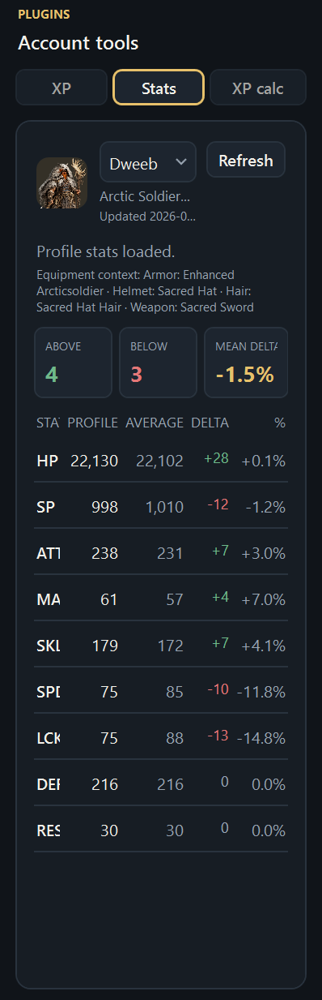
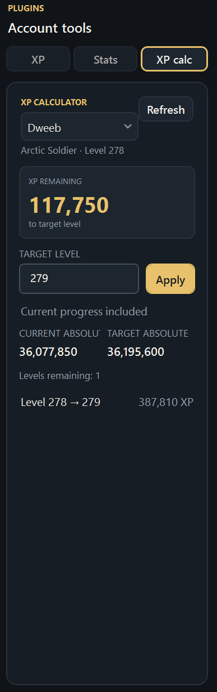
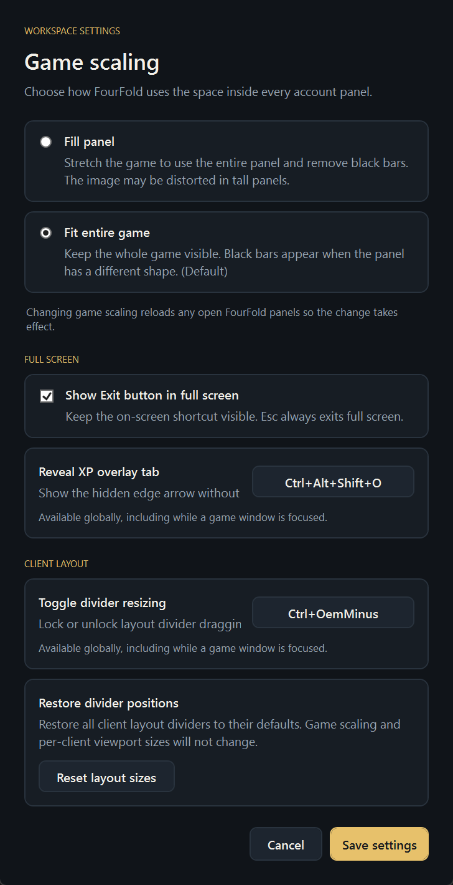

# FourFold Account Manager

A Windows client for running several FourFold accounts side by side, each in its own browser session.

<details>
<summary><strong>Screenshots</strong></summary>

| Class Comparison | XP Calculator |
|---|---|
|  |  |
| **Workspace Settings** |  |
|  |  |

</details>

## Features

- **Accounts**: saved logins (stored in Windows Credential Manager), favorites and custom order.
- **Layouts**: run up to five games in a grid, or give each account its own tab.
- **Theatre mode and full screen**: hide everything but the games.
- **Plugins**: XP tracker, stats, XP calculator and a speedrun timer in a RuneLite-style strip. Click an icon to open its panel, drag icons to reorder them, and use the wrench to switch plugins off or change the Timer's keys. The button at the right of the toolbar hides or shows the strip.
- **Overlays**: drag XP/hr, stats, XP calc and timer cards anywhere over the game.
- **Second monitor**: pop the tools panel into its own window, or float individual cards on any screen.
- **Shared XP leaderboard**: daily, weekly and monthly XP gains across opted-in players.
- **Store blocking**: optionally stop the in-game store and gold buttons from opening (Settings → Display).

## Shortcuts

App shortcuts can be changed on the **Shortcuts** tab in Settings; the Timer's keys are in its plugin settings (wrench → Timer cog).

| Action | Default |
|---|---|
| Toggle theatre mode | Ctrl+Alt+Shift+T |
| Next / previous tab | Ctrl+Alt+Shift+Right / Left |
| Timer split / finish / reset | Ctrl+Alt+Shift+S / F / R |
| Reveal overlays tab | Ctrl+Alt+Shift+O |
| Toggle divider resizing | Ctrl+Alt+Shift+L |

**Esc** leaves full screen or theatre mode. **F5** reloads a game panel and can't be rebound.

## Install

Download the latest release from [GitHub Releases](https://github.com/CodySimonds65/FourFoldAccountManager/releases). It needs Windows (x64) and the [Microsoft Edge WebView2 Runtime](https://developer.microsoft.com/microsoft-edge/webview2/).

### Run from source

Requires the .NET 10 SDK.

```powershell
dotnet build FourFoldAccountManager.sln -c Release
dotnet run --project src/FourFoldAccountManager.Desktop/FourFoldAccountManager.Desktop.csproj
```

<details>
<summary><strong>Leaderboard service (maintainers)</strong></summary>

The desktop uses `https://fourfold-shared-xp-leaderboard.onrender.com`; override it with `FOURFOLD_LEADERBOARD_URL`. Local XP tracking works without it. The server reads public profiles itself and never accepts XP values from the client.

**Backup:** use PostgreSQL 16+ tools against Neon's direct TLS endpoint, with credentials in `PG*` environment variables. Dumps contain profile IDs and XP data, so keep them private.

```powershell
pg_dump --format=custom --no-owner --no-acl --file=leaderboard.dump
pg_restore --list leaderboard.dump
```

**Restore:** into a new empty database, then check table counts and `/health/ready` before switching the service. Rolling back code doesn't undo migrations, so only deploy images compatible with the current schema.

**Erase:** disconnect clients, disable collection, then purge the four application tables, the provider backups and local caches.

</details>

## License

Copyright 2026 Cody Simonds. Licensed under the [Apache License 2.0](LICENSE).
